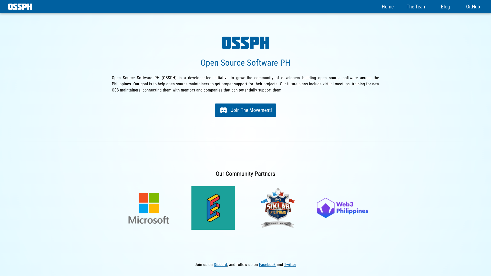

# Open Source Software PH

Open Source Software PH

## Install the dependencies
```bash
yarn
# or
npm install
```

### Start the app in development mode (hot-code reloading, error reporting, etc.)
```bash
yarn dev
# or
npm run dev
```


### Lint the files
```bash
yarn lint
# or
npm run lint
```


### Build the app for production
```bash
yarn build
# or
npm run build
```

### Customize the configuration
See [Configuring quasar.config.js](https://v2.quasar.dev/quasar-cli-webpack/quasar-config-js).
