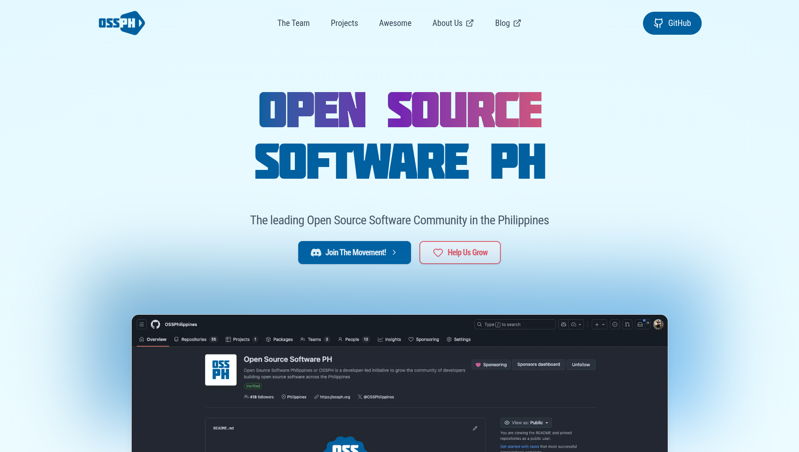

# OSSPH.org

Official website for Open Source Software Philippines (OSSPH), built with Next.js App Router.

OSSPH.org highlights the Filipino open source community through project showcases, team profiles, and curated awesome lists.

## Preview



## Tech Stack

- Next.js 16 (App Router)
- React 19
- TypeScript
- Tailwind CSS 4
- Radix UI primitives
- Vercel Analytics and Speed Insights

## Getting Started

### Prerequisites

- Node.js 20+
- pnpm (recommended) or npm

### Install

```bash
pnpm install
```

### Run development server

```bash
pnpm dev
```

Open http://localhost:3000 in your browser.

## Available Scripts

```bash
pnpm dev     # Start local dev server
pnpm build   # Build for production
pnpm start   # Run production build
pnpm lint    # Run ESLint
```

## Contributing

Contributions are welcome.

1. Fork the repository
2. Create a feature branch
3. Make your changes
4. Run lint and build checks
5. Open a pull request

## Community

- GitHub: https://github.com/OSSPhilippines
- Discord: https://discord.com/invite/DvtqKrWb86
- Facebook: https://www.facebook.com/ossph.org
- X/Twitter: https://x.com/OSSPhilippines
